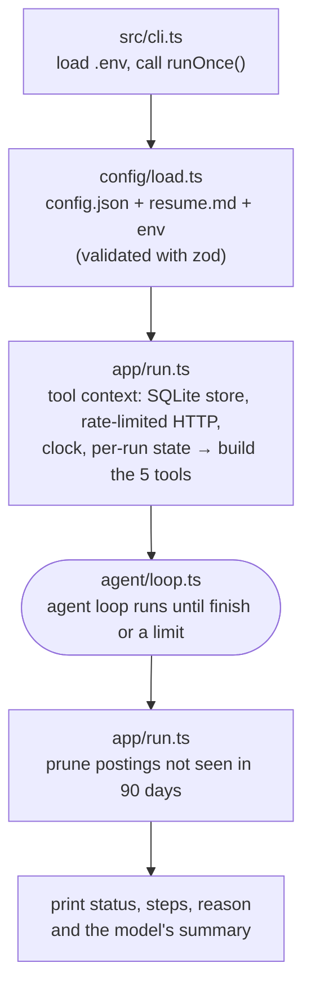
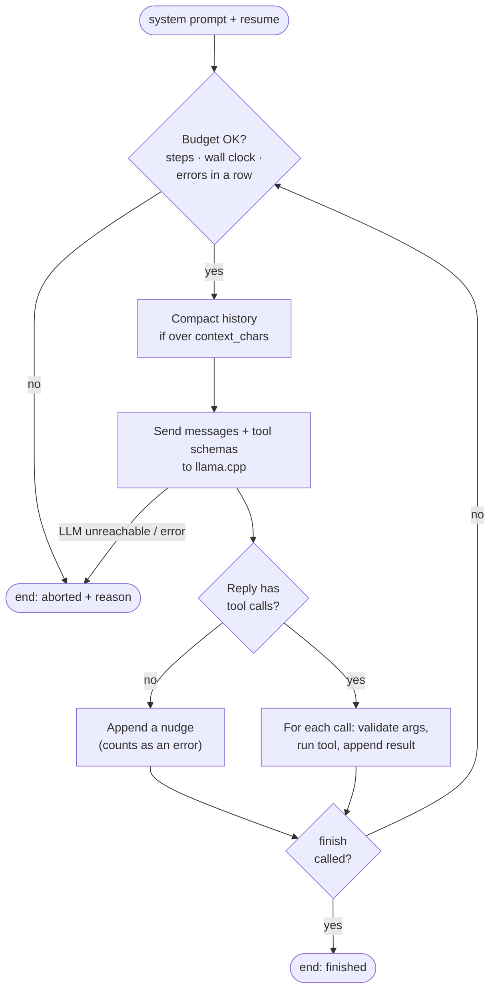
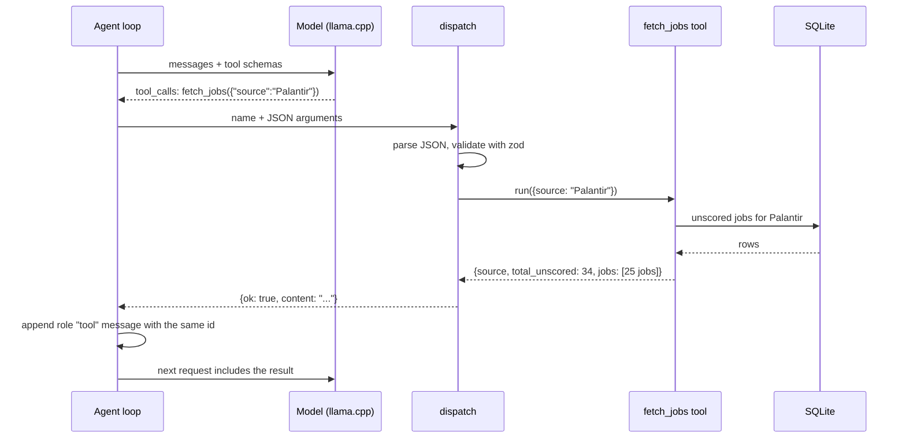
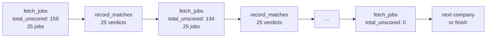
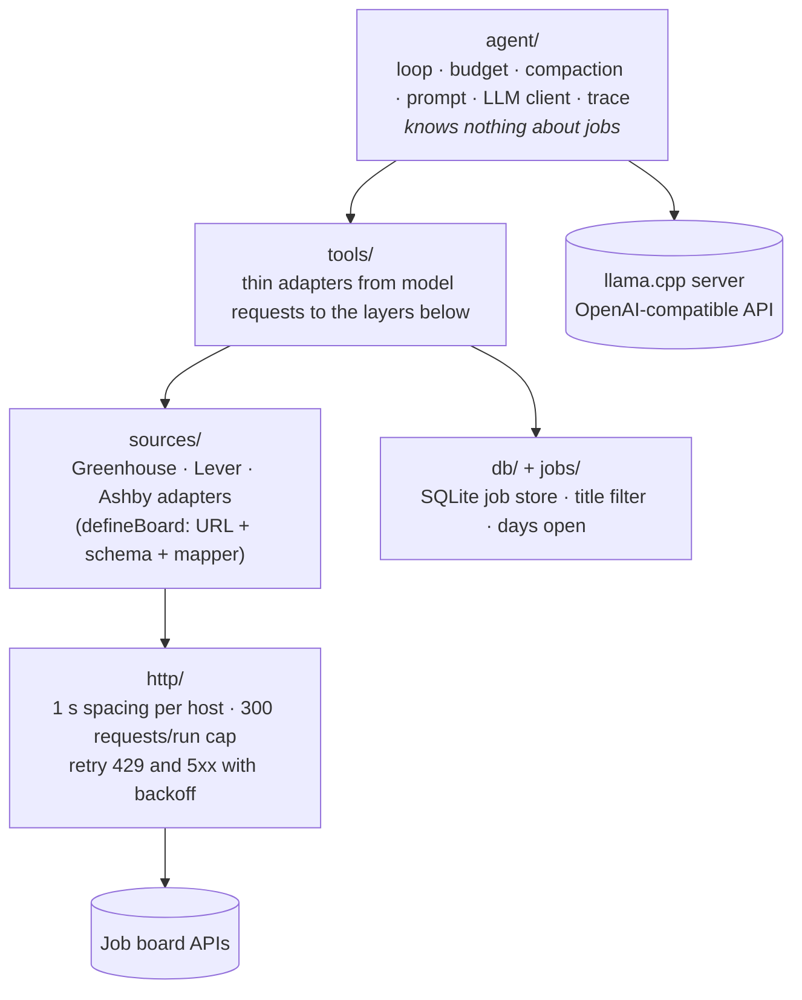
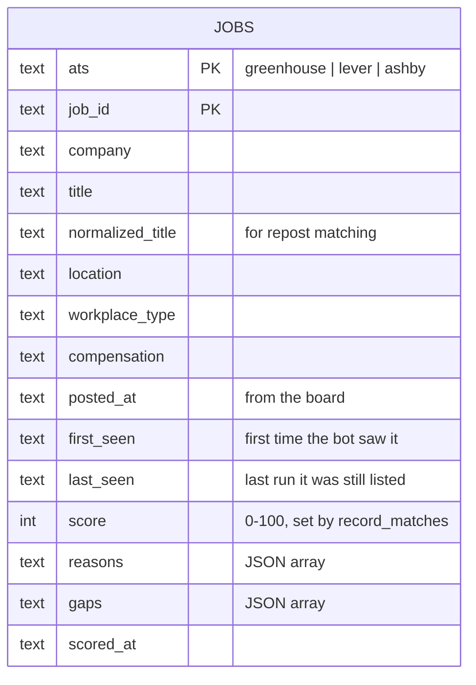
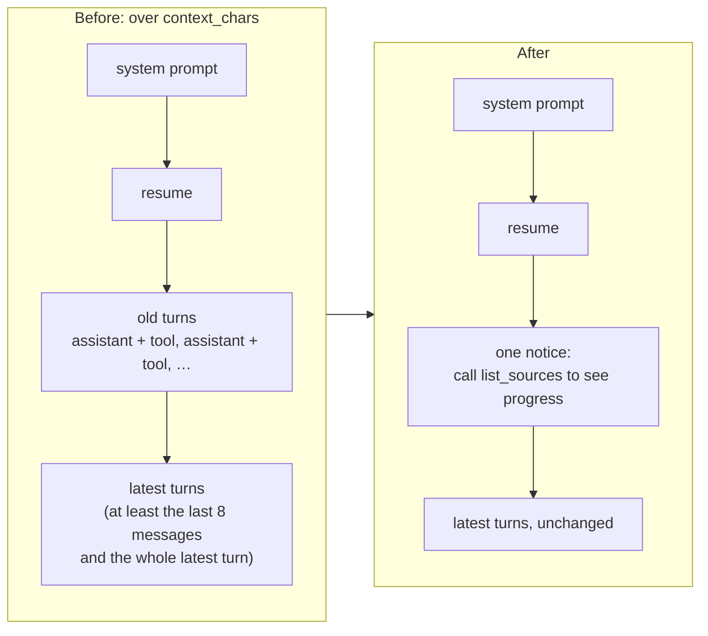

# myjobbot

An autonomous agent that pulls software-engineering postings from company job boards
(Greenhouse, Lever, Ashby) and saved JSearch searches (Google for Jobs: LinkedIn, Indeed and
more), scores them against your resume with a local LLM, and keeps
history in SQLite to spot long-open "ghost" postings.

Design: `docs/superpowers/specs/2026-10-03-myjobbot-design.md`

## Setup

```bash
npm ci
cp .env.example .env            # set LLM_API_KEY
mkdir -p data
cp examples/config.json data/   # list your target companies
cp examples/resume.md data/     # replace with your resume
```

The LLM server must be llama.cpp `llama-server` started with `--jinja` and a
tool-calling model.

## Run

```bash
npm start -- run
```

Each run gets a UUID (printed as `run <id> finished after …`). Every log line carries it as
`run_id`, and every file name ends with it, so one run's files sort together:

| File | One line per |
|---|---|
| `data/runs/<timestamp>-<run_id>.jsonl` | Trace event: starting messages, model replies, tool calls and results, nudges, compactions, end |
| `log/<timestamp>-<run_id>.llm.jsonl` | Raw LLM response, including token usage and llama.cpp timings |
| `log/<timestamp>-<run_id>.jobs.jsonl` | Board download: company, board, job count, and the normalized jobs (descriptions omitted) |

Set `MYJOBBOT_LOG_DIR` to move the `log/` folder.

## Web UI

```bash
npm run serve        # http://localhost:8080
```

A read-only view of the database with three tabs:

| Tab | Shows |
|---|---|
| **Recommended** | Jobs from your configured sources scoring at or above `match_threshold`, best first, with the model's reasons and gaps |
| **All jobs** | Every job retrieved, scored or not, including ones the title filter hid from the model |
| **Reasoning** | Every scoring decision with its run ID, newest first. Kept as history in the `verdicts` table, so re-scoring never overwrites the earlier reasoning |

Each tab shows 100 rows and loads the next 100 as you scroll (or via "Load more"). Edits to
`data/config.json` show up on the next page load. Set `MYJOBBOT_PORT` / `MYJOBBOT_HOST` to
change where it listens. There is no login: keep it on your LAN.

## Develop

```bash
npm run check   # typecheck + tests + habit-hooks
```

## Deploy with Docker

On the server:

```bash
git clone <repo> myjobbot && cd myjobbot
cp .env.example .env              # set LLM_API_KEY; optionally SCHEDULE and TZ
mkdir -p data
cp examples/config.json data/     # your companies
cp examples/resume.md data/       # your resume
docker compose up -d --build
```

The container runs `myjobbot run` on `SCHEDULE` (default `30 * * * *`, every hour at :30, in `TZ`,
default UTC). After a board's backlog is scored, each run only scores new postings, so hourly runs
are short; a run never starts while the previous one is still going.
Everything it writes goes to the host `data/` folder: `myjobbot.db`, `runs/` traces and
`log/` files.

| Task | Command |
|---|---|
| Open the web UI | `http://<server>:8080` (the `web` service) |
| Run once now | `docker compose run --rm myjobbot run` |
| Watch runs | `docker compose logs -f myjobbot` |
| Update after `git pull` | `docker compose up -d --build` |
| Stop | `docker compose down` |

The container runs as uid 1000. If your server user has a different uid, run
`sudo chown -R 1000:1000 data`. If the container can't resolve the LLM host (LAN-only DNS),
add `extra_hosts: ["llm.home.arpa:192.168.1.50"]` to the service in `compose.yaml`.

`tests/docker.sh` builds the image and checks the container's behaviour (needs Docker).

---

## How it works

### The big idea

myjobbot is **an LLM in a loop with tools**. The model never touches the internet or the
database directly. It can only ask to call one of five tools. The TypeScript code decides
whether that's allowed, runs it, and hands the result back.

- **The model** decides what to do next.
- **The code** does the work and enforces every limit.

### One run, start to finish



### The loop

The loop lives in `src/agent/loop.ts` and is under 100 lines. It starts with two messages:
the system prompt (the rules for the job, from `src/agent/prompt.ts`) and your resume.
Then it repeats one step.



A typical run makes this sequence of calls:

```
list_sources → fetch_jobs → record_matches → fetch_jobs → record_matches → … → fetch_jobs → finish
```

### A tool call, up close

Every tool is defined with a zod schema (`src/tools/tool.ts`). `defineTool` turns it into
JSON Schema, which goes to the model in the `tools` field of every request. That is how the
model knows `fetch_jobs` takes `{company: string}`.



**Errors are data, not crashes.** `dispatch` never throws. Bad arguments, an unknown tool,
or a board that's down all come back to the model as `{"error": "…"}` (capped at 2,000
characters), so the model can correct itself. That self-correction is most of why agents
work. Three failures in a row and the code ends the run.

### The five tools

| Tool | What it does |
|---|---|
| `list_sources` | Each company board and saved search, with this run's progress: `fetched`, `total_unscored`, `fetch_failed` |
| `fetch_jobs` | The first call per source per run downloads the board, or calls JSearch if the search is due. Every call returns **at most 25** unscored jobs that pass the title filter, plus `total_unscored`; search pages also say whether they were refreshed |
| `record_matches` | Saves up to 25 scores (0–100), with reasons and gaps, in one call |
| `get_job_details` | A placeholder in v1. Full descriptions are stored but not yet shown to the model |
| `finish` | Records the model's summary and ends the loop |

**Paging needs no page numbers.** The model scores a page and calls `fetch_jobs` again.
The database only returns jobs that are still unscored, so each call gets the next batch
until `total_unscored` is 0.



The board is downloaded only on the first `fetch_jobs` call per company per run. Later
calls reuse that download and just query the database. A failed download isn't cached, so
the next call retries it.

### The plain-code layers

Everything below the agent is ordinary, deterministic code.



- **Sources:** each adapter is a URL, a zod schema for the board's response, and a mapper
  to a common `Job` shape.
- **HTTP:** requests to the same site are at least 1 second apart and capped at 300 per run,
  and 429 and 5xx responses are retried with backoff that honors `Retry-After`. A looping
  agent can't hammer a job board.
- **Title filter:** postings like sales, recruiting and management are stored but never
  shown to the model, which saves steps. Include terms match word prefixes ("engineer"
  matches "Engineering"); exclude terms match whole words ("intern" rejects "Interns" but
  not "Internal").

### What a job row remembers



**Fishing-post detection:** "days open" counts from the oldest date the bot has, either
`posted_at` or `first_seen`, across all rows with the same company and normalized title.
That way a job reposted under a new ID still shows its true age. Over 60 days
(`ghost_threshold_days`) sets `possible_ghost: true`, and the model lowers its score a
little. Rows not seen for 90 days (`job_retention_days`) are pruned after each run.

### Context compaction

Long runs would overflow the model's context, so history is trimmed. This is safe because
**the database, not the conversation, is the agent's memory**: tools always return current
state.



- The kept part always starts on an assistant message, so no tool result is left without
  the request that produced it.
- Later overflows fold the old notice in, so the start of the conversation (system prompt,
  resume, notice) stays byte-identical and llama.cpp's prompt cache keeps working.
- After compaction the model calls `list_sources` to see which sources are done.

### Design lessons built into it

1. **Limits live in code, not the prompt.** The step cap, the time cap, the error streak and
   the nudge are all enforced in `agent/budget.ts` and `agent/loop.ts`. The model can't
   argue its way past them.
2. **The database is the memory.** That's what makes compaction safe, and it's why a crashed
   run loses nothing: unscored jobs are offered again on the next run.
3. **Keep the prompt prefix stable** so a local model's prompt cache stays warm.
4. **The loop knows nothing about jobs.** Job knowledge lives in the tools and
   `agent/prompt.ts`. The same loop could run a different agent, and a fixed-order pipeline
   could call the same tools if the agent approach ever proves unreliable.
5. **Everything is traced.** Every model reply, tool call, nudge and compaction is appended
   to `data/runs/<timestamp>.jsonl`.

### Configuration knobs (`data/config.json`)

| Setting | Default | What it controls |
|---|---|---|
| `companies` | `[]` | `{name, ats, slug}` per company board (at least one company or search) |
| `searches` | `[]` | Saved JSearch searches: `{name, query, remote_only, country}`. Needs `JSEARCH_API_KEY` |
| `jsearch.monthly_request_cap` | 190 | JSearch requests allowed per calendar month (free tier is 200) |
| `jsearch.refresh_hours` | 24 | Each search calls JSearch at most once per this many hours |
| `jsearch.date_posted` | `3days` | Only postings this recent: `today`, `3days`, `7days`, `30days` |
| `preferences` | `""` | Free text added to the system prompt |
| `match_threshold` | 70 | Score at which a job counts as a match |
| `ghost_threshold_days` | 60 | Days open before `possible_ghost` |
| `job_retention_days` | 90 | Days unseen before a job row is pruned (must exceed the ghost threshold) |
| `title_filter.include` / `.exclude` | engineering terms / sales, recruiting, management, interns | Which postings the model sees |
| `agent.max_steps` | 600 | Step cap per run |
| `agent.max_wall_clock_min` | 120 | Time cap per run |
| `agent.max_consecutive_tool_errors` | 3 | Errors in a row before aborting |
| `agent.context_chars` | 160000 | History size that triggers compaction |
| `http.*` | 1 s spacing, 300 requests, 2 retries, 30 s timeout | Politeness toward job boards |

### Saved searches (JSearch)

JSearch searches Google for Jobs, which includes LinkedIn, Indeed, Glassdoor and company sites,
without scraping LinkedIn. Results are stored and scored like board jobs. A result is skipped when
the same employer and title already came from a company board you list. Budget: every request
is recorded in the `api_calls` table; a search refreshes at most once per `refresh_hours`, and
never once the month's count reaches `monthly_request_cap`. When a search isn't due,
`fetch_jobs` serves the stored jobs and says why. Each request writes a `search_fetch` line to
the run's jobs log.

### First live run (2026-10-03)

Palantir's Lever board with `qwen3-coder-30b` on llama.cpp: **18 steps in 8.5 minutes**,
all 159 title-filtered jobs scored, 5 at 70 or above, no tool errors, one nudge. Scores
clustered heavily: 85 of 159 got exactly 40. Two likely causes are that v1 only gives the
model titles and locations, and that the "below 40" line in the prompt acts as an anchor.

### Where to look to learn more

- **The trace** in `data/runs/*.jsonl`. Read one top to bottom to see exactly what the model
  saw and decided.
- **`tests/agent-loop.test.ts` and `tests/e2e.test.ts`.** They drive the real loop with a
  scripted fake model, the easiest way to try "what if the model does X?".
- **`src/agent/prompt.ts`.** The only place the model's instructions live.

### Roadmap

This covers plan 1 of 4 (the agent core). Still to come: the email digest, Glassdoor
ratings, and Docker plus cron deployment.
